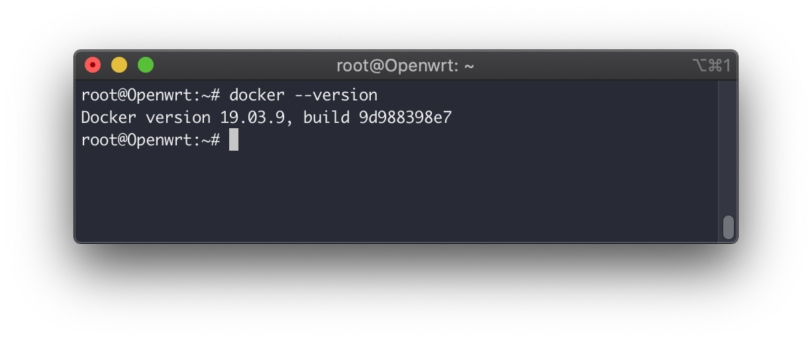

由于 Openwrt 的定位是面向小型主机，尤其是路由器这种，它本身并不会支持太多的软件包和功能。官方有一个 opkg 的命令用来管理软件包，类似于 Ubuntu 上面的 apt，你可以从[这里](https://openwrt.org/packages/index/start)看到所有支持的软件。

现在最流行的便是容器化技术了，像 Docker 这样的技术只需要宿主内核为 Linux 即可，宿主操作系统只要支持 Docker，基本就是能干所有事情了。本文简单的总结一下在 Openwrt 上安装和使用 Docker 的步骤。

首先去软件中心安装 Docker 的插件，或者离线安装最新的[版本](https://github.com/koolshare/ledesoft/blob/master/docker/docker.tar.gz)。


接下来就是安装 Docker 包了，我们可以先尝试用这个插件的安装功能。


安装目录建议填写非系统盘的路径，因为 Docker 和镜像、容器将会占据大量的磁盘空间，建议划分 10GB 以上，而且分区格式最好为 ext4，总之 NTFS 这种是不行的。镜像库地址可以去[阿里云](https://help.aliyun.com/document_detail/60750.html)上面申请一个免费的地址，由于 Docker 官方 Hub 在国内 pull 的时候非常缓慢，一个国内的镜像库会大大的加快我们的速度。

提交之后，切换到查看日志的 tab，如果顺利的话，你会看到如下的提示信息。


其他的任何信息，你都可以认为安装没有成功。你可以多试几次，实在不行我们可以采用下面的办法。

去 Docker [官网](https://download.docker.com/linux/static/stable/x86_64/)下载最新的软件包，比如 docker-19.03.9.tgz。你可以在你的电脑上下载，或者挂上你的下载器之类的。前一步的失败便是由于下载这个包太慢，导致了超时。

下载完成后可以利用“文件管理”的功能上传到 Openwrt 的目录，比如示例中的 `/mnt/sda4/temp` 文件夹下面。拷贝执行文件到 Docker 插件指定的路径。

```shell
tar -xzvf /mnt/sda4/temp/docker.tgz
mv /mnt/sda4/temp/docker/* /mnt/sda4/docker/bin
```

这时候再去插件页面，点击 Run 就会出现上述成功的信息了。

刷新你的 Terminal，运行 `docker --version` 出现对应的版本信息即表示已经安装成功了。



由于这个插件的不完善，Docker 在重启之后是不会自动运行的，我们需要手动到这个插件页面点击 Run 按钮。

Docker 让一切都变得有可能了，接下来我们会探讨更多有趣的功能。