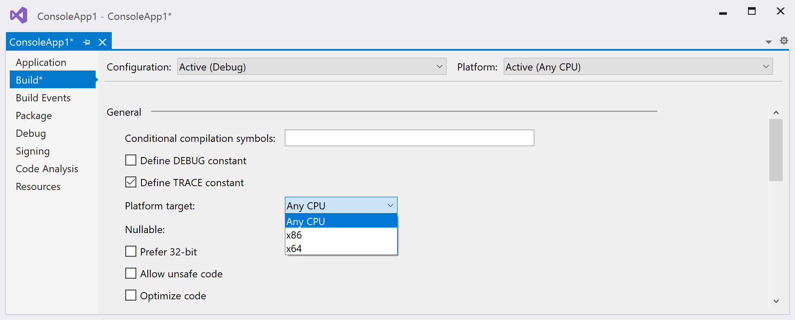
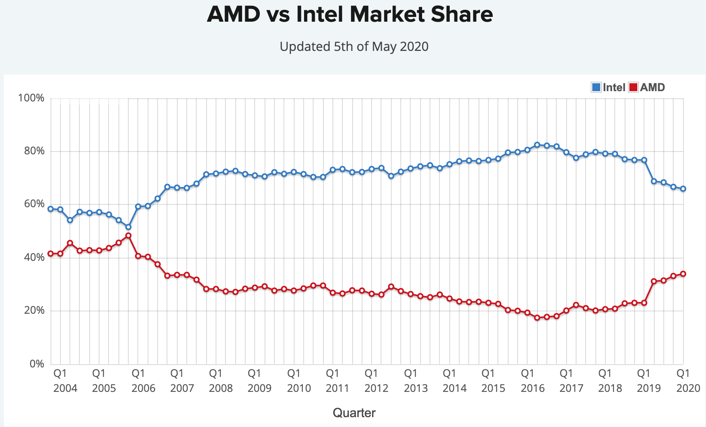
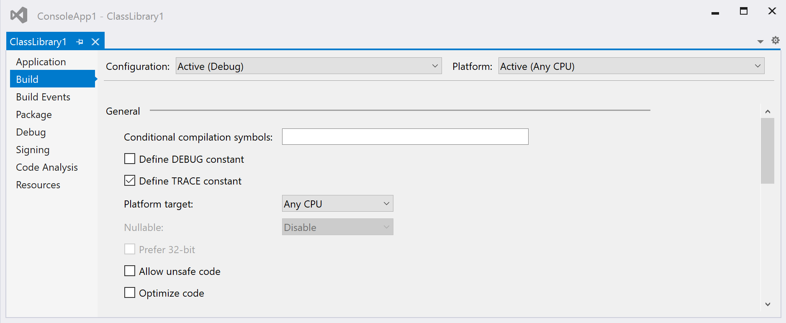

构建 .NET 应用程序的时候，通常我们需要决定应用程序运行在什么目标平台上面。如果你是使用 Microsoft Visual Studio 这样的 IDE 的话，会发现类似于下面的设置界面。



在 Platform target 下拉列表中，我们可以选择 `Any CPU`、`x86` 以及 `x64`。

那么他们到底有什么区别，以及如何选择目标平台呢？本文尝试回答这些问题。

简单的说，**这些设置选项指定了应用程序所运行的目标平台的 CPU 指令架构**。要说清楚这个事情，我们先得回顾一些背景知识。

计算机的运行离不开：硬件（比如 CPU，内存，存储设备等等），和软件（比如微软的 Office，QQ 等等）。

其中最重要的一个硬件是 CPU，也就是我们常说的中央处理器，它之于计算机就相当于人体的大脑，是处于核心地位。而最重要的一类软件呢叫做操作系统，他是衔接硬件以及我们日常使用的软件的中间桥梁。

[CPU 的市场](https://www.cpubenchmark.net/market_share.html)一直被 Intel 和 AMD 两家公司所垄断，这两家中 Intel 又是占据较大市场份额。



[Intel 公司](https://en.wikipedia.org/wiki/X86)在 20 世纪 70 年代中后期分别发布了 [Intel 8086](https://en.wikipedia.org/wiki/Intel_8086) 和 [8088](https://en.wikipedia.org/wiki/Intel_8088) 处理器。这两款处理器被设计成 16 位的指令集。80 年代，Intel 又相继推出了 32 位指令集的 [Intel 80386](https://en.wikipedia.org/wiki/Intel_80386) 和 [80486](https://en.wikipedia.org/wiki/Intel_80486)。这些 32 位指令集的 CPU 通常被称作 *80x86*，随着时间的推移以及 Intel 的市场垄断的加剧，就被简称为 x86 系列的处理器。

1999 年 AMD 公司设计的兼容 x86 架构的 [64 位](https://en.wikipedia.org/wiki/X86-64)指令集 CPU，它可以兼容 16 位以及 32 位的 x86 处理器。或许你会好奇，为什么 64 位的 x86 架构被 AMD 公司占了先机。这里其实最根本的原因在于 Intel 公司自己：Intel 在开发 64 位 CPU 的时候做了一个错误的决定，他们设计的 [IA-64](https://en.wikipedia.org/wiki/IA-64) 处理器是与市场上已有的 x86 处理器不兼容的。当 Intel 最终反应过来的时候，AMD 公司已经设计并推出了兼容 x86 的 64 位处理器，Intel 公司不得不从遵循 AMD 公司的脚步。Intel 将它命名为 Intel 64，但它实际上跟 AMD 64 几乎完全一致，业界普遍认为 Intel 直接抄袭了 AMD。

所以，x86 其实本身并没有指定具体的处理器位数，他代表了目前市场上最流行的一种 CPU 架构，这种架构都是基于最初的 8086。从最初的的 16 位，到后来的 32 位，再到当下最流行的 64 位。

目前民用市场上主要就是 32 位和 64 位的 x86 处理器。虽然他们有不同的叫法，但归根到底都是基于 Intel x86 系列的处理器。

> 32 位处理器：通常简称为 `x86`，Linux 发行版本通常称为 `i386`（对应 Intel 公司发布的第一款 32 位处理器 **I**ntel 80**386**）
>
> 64 位处理器：微软以及 Oracle 习惯称为 `x64`，苹果公司通常称为 `x86_64` 或者 `x86-64`，Linux 发行版本则成为 `AMD64`

CPU 架构确定之后，我们就需要选择操作系统了。一般现代的操作系统都是同时支持 32 位或者 64 位。在 32 位 CPU 下面，只有 32 位版本的操作系统可以运行。在 64 位 CPU 下面，32 位和 64 位的操作系统都可以运行。

> 如果你的 CPU 是支持 64 位，而操作系统是 32 位版本的，Windows 会有这样的提示：_32-bit operating system, x64-based processor_

类似于上面的机制，我们的应用程序也遵循相似的逻辑。如果我们的操作系统是 32 位的，我们的应用程序必须编译成 32 位才能在其中运行。如果操作系统是 64 位的，我们的应用程序既可以是 32 位也可以是 64 位。通常，64 位的操作系统会有一个 32 位的虚拟层，来允许我们运行 32 位的应用程序，比如 windows 的 [WoW64](https://en.wikipedia.org/wiki/WoW64)。

Ok，回到我们的 .NET 应用程序上面来。

我们大家都知道，编写 .NET 应用程序的代码是不用考虑底层的 CPU 架构的。只要我们的代码都是托管代码，CLR 会帮助我们翻译编译好的 IL 指令集成对应 CPU 架构的机器代码。

但是，在最终打包发布这个应用程序的时候我们需要决定，到底该如何选择目标平台。这是为什么呢？

**归根到底，我们的应用程序所依赖的程序集决定了一切。** 我们的应用程序最终都是运行在 x86 CPU 架构下面（当然，现在还有一些 ARM 之类的），运行时它的运行位数是确定的，是 32 位或者 64 位。我们设置是指明了，程序到底支持哪一种架构还是都支持。

假设，我们有如下的代码结构。入口程序 `ConsoleApp1` 以及一个类库项目 `ClassLibrary1`。入口程序依赖类库项目，以及一个第三方打包好的 DLL：`crypt.dll`。

```
- MyAwesomeSolution
  - ConsoleApp1  <- Entrypoint project
  - ClassLibrary1
```

你会发现，这里有很多的不确定性。究竟 `ConsoleApp1` 选择哪一种目标平台是由它所依赖的 `ClassLibrary1` 和 `crypt.dll` 共同决定的。`ClassLibrary1` 可以是 32 位或者 64 位的，`crypt.dll` 也是如此。

> 如果我们的项目（包括入口程序和类库项目）有 `32 位`的依赖：只能编译成 32 位版本的 exe 或者 DLL，也就是只能选择 **x86** 选项。
> 
> 如果我们的项目（包括入口程序和类库项目）有 `64 位`的依赖：只能编译成 64 位版本的 exe 或者 DLL，也就是只能选择 **x64** 选项。
>
> 如果我们的项目（包括入口程序和类库项目）的依赖**都是** `Any CPU`：可以编译成 32 位和 64 位版本的 exe 或者 DLL，也就是可以选择 **Any CPU** / **x86** / **x64** 选项。

针对入口应用程序，**Any CPU** 选项下面还有一个选项叫做 **Prefer 32-bit**。如果勾选了这个选项，我们的应用程序可以运行在任意的 CPU 架构下面，包括 x86，x64 以及 [_ARM_ 架构](https://stackoverflow.com/a/12066861/3022229)。在 x86 和 x64 下面，应用程序都以 32 位的形式运行。这主要是考虑 32 位的应用程序兼容性最好，可以运行在 32 位或者 64 位下面。

顺便提一句，**Prefer 32-bit** 选项只针对于入口程序有效，在类库项目下面，这个选项是被 disable 的。



总结一下，应用程序的顺利运行取决于三个方面：操作系统的位数，应用程序的位数，以及应用程序依赖 DLL 的位数。

如果我们的操作系统是 `32 位`的，它也就只能运行 `32 位`或者 `Any CPU` 的应用程序。应用程序的依赖也必须是 `32 位`或者 `Any CPU` 类型的。

如果我们的操作系统是 `64 位`的，

- 它可以运行 `Any CPU` 的应用程序，应用程序的依赖必须是 `x64` 或者 `Any CPU` 类型的。因为这种情况下，我们的应用程序是以 `64 位`的形式运行。

- 它可以运行 `Any CPU` + `Prefer 32-bit` 的应用程序，应用程序的依赖必须是 `x86` 或者 `Any CPU` 类型的。因为这种情况下，我们的应用程序是以 `32 位`的形式运行。

- 它可以运行 `x86` 的应用程序，应用程序的依赖必须是 `x86` 或者 `Any CPU` 类型的。因为这种情况下，我们的应用程序是以 `32 位`的形式运行。

- 它可以运行 `x64` 的应用程序，应用程序的依赖必须是 `x64` 或者 `Any CPU` 类型的。因为这种情况下，我们的应用程序是以 `64 位`的形式运行。

不按照上述规则的应用程序，都会抛出 `BadImageFormatException` 的异常。